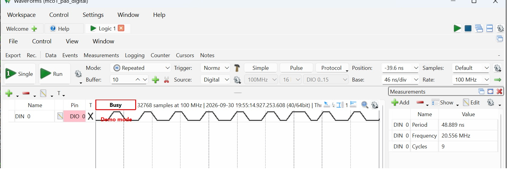

# Project Name

Baremetal-mco1-generation

## Project
The project focus on the generating the signal from MCO1 through PA8. The source selected for the MCO1 is PLLCLK which is generated through the PLL1. The source for the PLL unit is HSI (16MHz).

### Target Hardware
	
- MCU:	STM32F446RE
- Board:	NUCLEO-F446RE
- Toolchain:	STM32CubeIDE
- Hardware- Logic Analyser

#### Feature
- 100MHz signal generated through MCO1 which is read through logical analyzer at PA8.
- Source for the PLL set at HSI(16MHZ)

##### Project Structure
```text
├── Inc/           # Header files (None)
├── Src/           # Source files (main)
├── Startup/       # Startup assembly file
├── STM32F446RETX_FLASH.ld   # Linker script (Flash)
├── STM32F446RETX_RAM.ld     # Linker script (RAM)
├── .project / .cproject     # STM32CubeIDE project files
└── .gitignore
```
###### Usage API

```c
void mco1_m4(void);
```
**NOTE:**
- Clock source is determined from the Block Diagram in the Datasheet DS10693 Rev 11.
- Nucleo board pin for the mco1 output in PA8 - f446re schematic MB1136.
- M,N,P parameter for the MCO1 signal selection and for the PLL is set to satisfy the condition mentioned in the reference manual.
- 	This register is used to configure the PLL clock outputs according to the formulas:
• f(VCO clock) = f(PLL clock input) × (PLLN / PLLM)
• f(PLL general clock output) = f(VCO clock) / PLLP
• f(USB OTG FS, SDIO) = f(VCO clock) / PLLQ
- PLLP[1:0]: The software has to set these bits correctly not to exceed 180MHz on this domain.PLL output clock frequency = VCO frequency / PLLP with PLLP = 2, 4, 6, or 8
-  PLLN[8:0]: The software has to set these bits correctly to ensure that the VCO output frequency is between 100 and 432MHz.
- PLLM[5:0]: The software has to set these bits correctly to ensure that the VCO input frequency ranges from 1 to 2MHz. It is recommended to select a frequency of 2MHz to limit PLL jitter.

  **Result**
  
